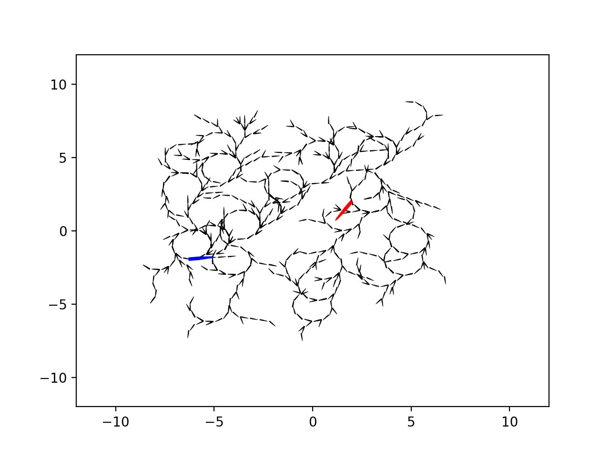

# dubins_rrt_star
Unoptimized Python implementation of RRT* path planning for a Dubins Car model. Note: searches for fully defined goal state (x,y,h).

Full search tree after with 2000 nodes, blue is start, red is goal:

Best path of same tree:
  
